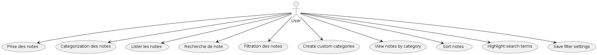
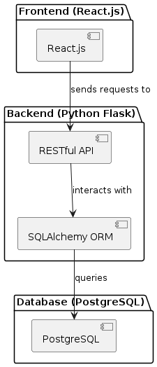
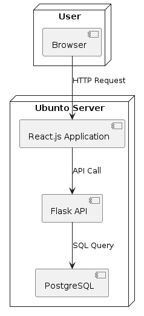

# Specification

## Étude des concurrents existants

### Concurrents existants

- **Concurrents A**: Description of their features, strengths, and weaknesses.
- **Concurrents B**: Description of their features, strengths, and weaknesses.
- **Concurrents C**: Description of their features, strengths, and weaknesses.

## Besoins fonctionnels

- **Prise des notes**:
  - Ability to create, edit, and delete notes.

- **Categorization des notes**:

  - Tagging system to organize notes by categories.
  - Ability to create custom categories.
  - Option to view notes by category.

- **Lister les notes**:
  - Display notes in a list view.
  - Sort notes by date, title, or category.

- **Recherche de note**:
  - Full-text search functionality.
  - Search by tags, categories, or specific fields.
  - Highlight search terms in results.

- **Filtration des notes**:
  - Filter notes by date range, category, or tags.
  - Combine multiple filters for precise results.
  - Save filter settings for future use.

## Besoins non fonctionnels

- **UI/UX**:
  - Intuitive and user-friendly interface.
  - Consistent design language across the application.
  - Accessibility features for users with disabilities.

- **Performance**:
  - Fast loading times and responsive interactions.
  - Efficient data handling and storage.
  - Scalability to handle increasing numbers of users and notes.

### Technical Specifications

#### Backend

- **Framework**: Python Flask
  - RESTful API architecture
  - SQLAlchemy ORM for database interactions

#### Frontend

- **Framework**: React.js
  - Modern functional components with hooks
  - Responsive design for mobile/desktop

#### Database

- **PostgreSQL**
  - Relational database design
  - Indexes for optimized queries
  - Full-text search capabilities

### Deployment

Linux Ubunto Server with:

- Python 12
- NodeJs 22 LTS
- PostgreSQL 16 Server
